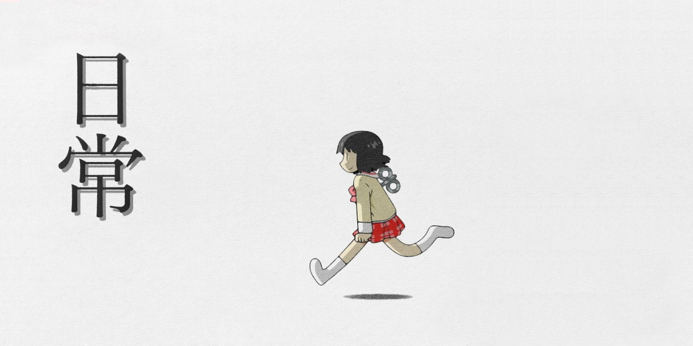

  

# Nano (なの) Template 


[](https://github.com/CamilleAbella/NanoTemplate/search?l=TypeScript&q=todo)


A Discord bot template in TypeScript

## Dependencies


## Template usage

### 1. Clone the project

- Replace the `Nano` word by your own bot name and run it:  
  `git clone --depth 0 -b master https://github.com/CamilleAbella/NanoTemplate.git Nano`

### 2. Prepare project

1. Go to your folder project and run `npm i`.
2. Make a `.env` file and place your token inside like this: `TOKEN=Your_Discord_App_Token`.
3. Open `nano.config.json` as Nano Config using `nano.config.schema.json` json-schema from your IDE.
4. Adjust properties in `nano.config.json`.
5. Create and link your own GitHub repository.

### 3. Code your bot in TypeScript

- Please do not code in the `index.ts`.
- Please hard keep the existing files.
- Please keep the existing commands and events too.
- Please use `src/app/Embed.ts` class to make embeds.
- Add your own commands in `src/commands/`.
- Add your own events in `src/events/`.
- Check the other commands and events for examples.
- The Discord client is in the `src/app/Globals.ts` file as `client`.
- The ApplicationClient is fetched in the `src/app/Globals.ts` file as `bot`.

### 4. Scripts explanation

```json5
{
  // Prettify the code automatically on build or push action.
  prettier: "prettier src --write",

  // Create the local "dist" runnable folder for deployment.
  build: "git rm -r --ignore-unmatch -f ./dist && npm run prettier && tsc",

  // Build and start directly the bot for debugging.
  start: "npm run build && node .",
}
```
